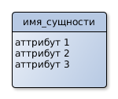
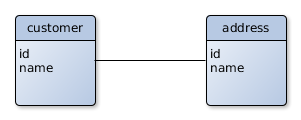
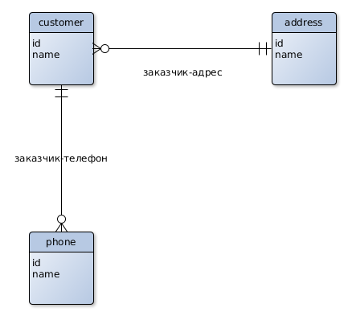

# ER-диаграмма
* <b>Сущность(entity)</b> - это нектороый объект, сохраненный в базе данных, например - customer,order,user и т.д.
* Сущность имеет имя и аттрибуты(свойства),и отображается следующим образом:

* <b>Relationship(отношение)</b> - это некоторая связь между двумя сущностями. Отношение рисуется ввиде линии, соединяющей сущности. Например клиент (customer) и его адрес:

* <b>Entity-Relationship (ER) диаграмма</b> - это диаграмма на которой видны сущности(entity) и отношения (relationships) между ними.
* <b>Crow's foot notation(нотация "воронья лапка")</b> - это простой и удобный способ выражения отношений между сущностями на ER-диаграмме.
* Cвязь имеет два индикатора, которые рисуются на обоих сторонах линии связи.
    1. Количественный индикатор определяет сколько раз
    экземпляр одной сущности (один и тот же клиент) может ассоциироваться с экземплярами другой сущности (например с адресами). Возможные значения:

    один

    

    или множество:

    

    2. Индикатор обязательности определяет обязанна ли связанная сущность существовать:

    

    или может отсутствовать:

    
* Рассмотрим пример ER диаграммы и распишем связи между сущностями:
  1. Заказчик-адрес: заказчик может проживать по одному и только по одному адресу. По одному адреcу могут проживать несколько заказчиков или ни одного.
  2. Заказчик-телефон: У заказчика может быть ноль или более телефонов, один телефон как правило имеет одного хозяина.

  
