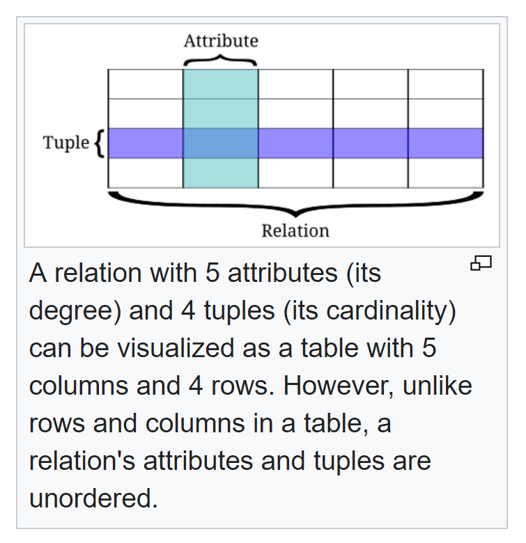

# Relation Databases
* Relation is a structure that consists of heading and body.
* Heading is a set of attributes, attribute contains name and data type.
    - Arity (relation degree) is a number of attributes.
* Body is a set of tuples, tuple is a collection of pairs, where every pair contains attribute name and value.
    - Cardinality it is the number of tuples in the body.



## Transactions
* Transaction is an atomic group of commands.
* Transactions have ACID properties:
    - Atomic: all commands are executed or none
    - Consistency: data is kept consistent (database constraints and business constraints)
    - Isolation: every transaction should be executed as if it is only transaction running.
    - Durability: after tx completes all its data should be persisted.
## Transaction anomalies
1. Non-repeatable read: when a transaction re-reads previously read data, it sees differences.
2. Lost updates: read-modify-write case with concurrent txs (ex: counter).
3. Dirty read: tx sees uncommitted data from other txs.
4. Phantoms: tx sees new rows when re-reads data by predicate.
5. Serialization anomaly: when concurrent tx execution doesn't mach any sequential one.
* Serialization anomaly example:

|  value |
|--------|
|  100   |
|  10    |

Concurrent txs:
Tx1: reads sum(value) then adds row: value 110.

Tx2 (concurrently): reads sum(value) then adds row: value 110.

Result:

| value |
|-------|
| 100   |
| 10    |
| 110   |
| 110   |

But any sequential result:

| value |
|-------|
| 100   |
| 10    |
| 110   |
| 220   |

So concurrent execution doesn't match any sequential one.

* Row-level locks and mvcc help to prevent such anomalies.
## Transaction Isolation Levels in PgSQL
| Level                                  | Dirty Read             | Lost Updates            | Non-Repeatable Read   | Phantom   | Serialization anomaly   |
|----------------------------------------|------------------------|-------------------------|-----------------------|-----------|-------------------------|
| Read uncommited (=Read Commited in Pg) | + (not possible in PG) | +                       | +                     | +         | +                       |
| Read Commited                          | -                      | +                       | +                     | +         | +                       |
| Repeatable Read                        | -                      | - (error, tx restart)   | -                     | -         | +                       |
| Serializable                           | -                      | - (error, tx restart)   | -                     | -         | - (error, tx restart)   |

## Indexes
* Syntax:
```sql
CREATE INDEX idx_name 
ON table_name(column1[,column2]) [USING idx_type]
```
* Index types: 
  - Hash: fast, only equality is supported.
  - Btree: a bit slower, comparisons supported. Time O(log n)
  - GIN: jsonb, full-text search.
  - GiST: for non-standard types, such as geodata.
* Composite index:
  - only used when first columns specified in the query, eg: 
```sql
create index idx on table(a,b,c);
select * where a = ...
select * where a = ... and b = ...
```
  - faster then two indexes on a and b:
```txt
algorithm for different indxes:
A = read rows, using index a
B = read rows, using b
intersect A and B

algorithm for COMPOSITE indxe:
just read rows using single index
```
* Что такое индекс на 2 колонки в Postgres

```sql
CREATE INDEX idx ON t (a, b);
```
Это ОДИН B-tree, где ключ = (a, b).
```txt
Упорядочивание:
(a1, b1)
(a1, b2)
(a1, b3)
(a2, b1)
(a2, b2)
(a3, b7)
```
👉 Сначала сортировка по a, внутри одинаковых a — по b.
* Такой индекс плохо работает по 2м диапазонам a и b, лучше два разных индекса+пересечение.
* Но используется для запросов вида: `a=a1 AND b>b1`:
>В B-tree индексах важен leftmost prefix: сначала поля с равенством, затем диапазон. 
>Если диапазон стоит первым, последующие колонки уже не участвуют в эффективном поиске.


# Window Functions

Window functions allow you to compute values over a "window" of rows
**without collapsing rows** (unlike aggregate functions).

Basic syntax:

``` sql
func_name(...) over (
    [partition by ...]
    [order by ...]
) as alias
```

------------------------------------------------------------------------

## 1. PARTITION BY

`PARTITION BY` splits the dataset into groups.\
The window function works **independently for each group**.

Example:

``` sql
select
    department,
    salary,
    avg(salary) over(partition by department) as avg_salary
from employees;
```

Each department gets its own average.

------------------------------------------------------------------------

## 2. ORDER BY inside the window

`ORDER BY` inside `OVER(...)` defines the **logical order of rows for
the window**.

Important:

-   **ORDER BY inside the window affects the function's behavior**
-   **ORDER BY outside SELECT does NOT affect window function results**,
    only final output ordering

Example:

``` sql
row_number() over(order by salary desc)
```

This ranks rows by salary for the window computation.

------------------------------------------------------------------------

## 3. ROW_NUMBER()

Assigns a **unique sequential number** to each row (no ties).

``` sql
select
    employee,
    salary,
    row_number() over(order by salary desc) as rn
from employees;
```

Result:
```
employee   salary   rn
  ---------- -------- ----
Bob        200      1
Carol      200      2
Dave       150      3
```
------------------------------------------------------------------------

## 4. RANK()

Gives the same rank to equal values, but **skips numbers** after ties.

``` sql
select
    employee,
    salary,
    rank() over(order by salary desc) as rnk
from employees;
```

Result:
```
employee   salary   rnk
  ---------- -------- -----
Bob        200      1
Carol      200      1
Dave       150      3
```
------------------------------------------------------------------------

## 5. DENSE_RANK()

Same as RANK, but **does NOT skip** numbers.

``` sql
select
    employee,
    salary,
    dense_rank() over(order by salary desc) as drnk
from employees;
```

Result:
```
employee   salary   drnk
  ---------- -------- ------
Bob        200      1
Carol      200      1
Dave       150      2
```
------------------------------------------------------------------------

## 6. AVG() as a window function

Works like a normal aggregate, but keeps all rows.

``` sql
select
    employee,
    salary,
    avg(salary) over() as avg_global
from employees;
```

Or with partitioning:

``` sql
avg(salary) over(partition by department)
```

Or with ordering (running average):

``` sql
avg(salary) over(order by salary)
```

------------------------------------------------------------------------

## 7. ORDER BY inside and outside the window --- Difference

### ORDER BY inside OVER()

Controls the function:

``` sql
row_number() over(order by salary desc)
```

### ORDER BY outside SELECT

Controls final output:

``` sql
... 
from employees
order by salary desc;
```

This **does not** change window function results.

------------------------------------------------------------------------

# Summary

| Function   | Ties (одинаковые знач.) | Skips Numbers | Requires ORDER BY?         | Common Use                 |
|------------|-------------------------|---------------|----------------------------|----------------------------|
| ROW_NUMBER | No                      | No            | Optional (but recommended) | Unique row IDs             |
| RANK       | Yes                     | Yes           | Yes                        | Ranking with gaps          |
| DENSE_RANK | Yes                     | No            | Yes                        | Ranking without gaps       |
| AVG        | N/A                     | N/A           | Optional                   | Running/partition averages |
