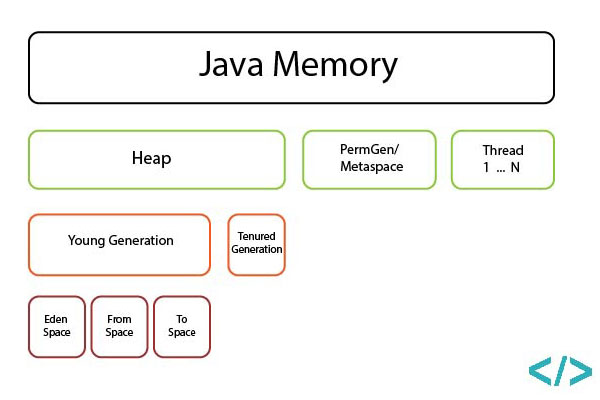

### Object Creation
1. Class loading
    - If the class is not loaded yet, the JVM loads it and prepares its static data.
2. Memory allocation
    - JVM allocates space for the new object in the heap.
3. Object header creation
    - JVM sets up the object header (mark word (some special data) + pointer to class metadata).
4. Default initialization
    - All fields of the object are automatically set to default values (0, false, null).
5. Constructor call
  JVM calls the constructor:
    - first calls super()
    - Instance field initializers
    - Instance initializer blocks
    - then runs the constructor body
6. Return reference
    - JVM returns a reference to the newly created object.

### Equals & HashCode

* equals() Contract
Java SE defines a contract that our implementation of the equals() method must fulfill. Most of the criteria are common sense. The equals() method must be:
  1. reflexive: an object must equal itself
  2. symmetric: x.equals(y) must return the same result as y.equals(x)
  3. transitive: if x.equals(y) and y.equals(z) then also x.equals(z)
  4. consistent: the value of equals() should change only if a property that is contained in equals() changes (no randomness allowed)

* hashCode() and equals() contract:
  1. consistency: the value of hashCode() may only change if a property that is in equals() changes
  2. equals consistency: objects that are equal to each other must return the same hashCode
  3. collisions: unequal objects may have the same hashCode
 
* Memory Leak: when there are objects present in the heap that are no longer used, but the garbage collector is unable to remove them from memory (huge static fields, thread locals etc)

### GC 


## GC этапы
| Этап | Суть |
|------|------|
| **Marking** | Поиск достижимых объектов. |
| **Sweeping** | Удаление недостижимых. |
| **Compacting** | Уплотнение живых объектов (не всегда). |

## Поколения памяти
| Область | Что хранится | Как чистится |
|---------|---------------|---------------|
| **Young Gen** (Eden + S0/S1) | Новые объекты | **Minor GC**, всегда STW |
| **Old Gen** | Долгоживущие объекты | **Major GC**, может быть concurrent |
| **Metaspace** | Классы, метаданные | Освобождается при выгрузке классов |
| **Stack** | Локальные переменные, вызовы | Освобождается автоматически |

## Как работает Young Gen
| Шаг | Описание |
|-----|----------|
| 1 | Eden заполняется |
| 2 | Minor GC запускается |
| 3 | Живые объекты копируются в survivor |
| 4 | Eden очищается |
| 5 | Несколько выживаний → в Old Gen |

## Stop-the-World (STW)
| Тип GC | STW |
|--------|-----|
| **Minor GC** | Всегда STW |
| **Major GC** | Частично или полностью STW |

## GC реализации
| GC | Особенности |
|----|-------------|
| **Serial GC** | 1 поток, полный STW |
| **Parallel GC** | Многопоточный STW |
| **CMS** | Concurrent mark, мало пауз |
| **G1 GC** | По умолчанию, регионный |
| **ZGC** | Паузы ~1–3ms, почти полностью concurrent |
| **Shenandoah** | Паузы <10ms |


  
### Java Memory Regions
1. Heap space - objects stored here.
2. Meta space - compiled objects of methods and classes are stored here.
3. Stack space - local variables and references stored here for each thread in Stack structure.



### Generics

* Type erasure - в рантайме нельзя получить тип List<String>.
* B,C extends A,List<A> listA = listB !ERROR иначе можно было бы в listB положить элемент C. ? - wildcard type & bounds нужны для решения этой проблемы:
  1. Upper bound List<? extends A> - добавлять объекты нельзя, можно итерировать считая все объекты типом A.
  2. Lower bound List<? super A> - можно добавлять родителя класса A, при итерации все объекты считаются типом Object.
  
### Reference types

1. Hard-references — стандартные ссылки на объекты, которые становится eligible for collection после недостижимости из root set
2. Soft-references — объекты могут удалятся GC при недостатке памяти

### Classloaders

* Loading order:
  1. if the Classloader has already loaded the class and returns the class from its cache,
  2. if not it asks their Parent ClassLoader
  3. if the Parent ClassLoader doesn’t have the class, the ClassLoader loads it from the associated location


* classId=classloader+FQDN


### Concurrency:

* Singleton wih double checked locking (valitale нужне для того, чтобы объект полностью инициализировался):
```java
class Foo {
    private volatile Helper helper = null;
    public Helper getHelper() {
        if (helper == null) {
            synchronized(this) {
                if (helper == null)
                    helper = new Helper();
            }
        }
        return helper;
    }
}
```

### LRU cache
* Для реализации LRU удобно использовать LinkedHashMap (нач размер, 0.75f, при get перемещать элемент в конец списка tue|false)
* Эта мапа хранит порядок элементов в двусвязном списке и может перемещать элемент в конец при доступе к нему, либо просто добавлять в конец списка новые элементы.
* Содержит метод boolean removeEldestEntry(Map.Entry<K,V> eldest), если он возвращает true, то eldest-элемент удаляется.
* Map хранит в себе в качестве значения не объект, а Node<Value> для быстрого перемещения элемента в списке.
* Resize происходит после вставки элемента, когда size > capacity * loadFactor, размер массива бакетов увеличивается в 2 раза.

[LRU cache](src/main/java/kg/arbocdi/theory/LRUCache.java)

### Object identity
* Every object in Java has its identity, which differs it from any other objects. 
* Identity hash code: if not overridden then hashCode==identityHashCode. 
```java
int hash = System.identityHashCode(Object o);
```
* IdentityHashMap uses identity hash as a key hash and compares keys by their identities k1==k2:
```java
String a = new String("xxx");
String b = new String("xxx");

map.put(a, 1);
map.put(b, 2);
//IdentityHashMap stores 2 records, HashMap will store 1 record only

```