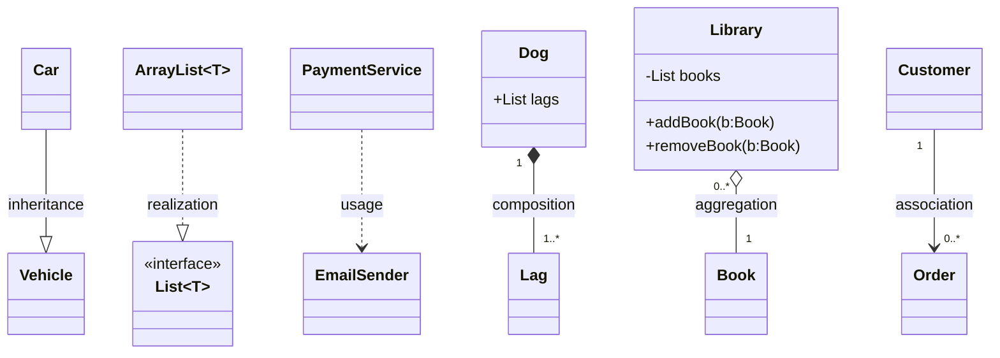

# UML диаграмма классов — краткий конспект

## Как выглядит класс на диаграмме

Класс изображается прямоугольником из 1–3 секций:

```
+----------------------+
| ClassName            |  (1) имя класса
+----------------------+
| - field: Type        |  (2) поля / атрибуты (опционально)
| # other: Type        |
+----------------------+
| + method(a: T): R    |  (3) методы / операции (опционально)
| + toString(): String |
+----------------------+
```

### Видимость
- `+` public
- `-` private
- `#` protected
- `~` package (default)

### Дополнительные обозначения
- *курсив* — абстрактный класс или метод
- `{static}` — статический член
- `<<interface>>` — интерфейс
- `<<enum>>` — перечисление

---

## Связи между классами

### 1. Ассоциация (Association)
**Смысл:** объект одного класса знает о другом и хранит на него ссылку.

**Обозначение:**
```
A -------- B
A ------> B   (направленная)
```

**Кратности (multiplicity):**
- `1` — ровно один
- `0..1` — ноль или один
- `*` или `0..*` — много
- `1..*` — минимум один

**Пример:**
`Order` → `Customer`

---

### 2. Агрегация (Aggregation)
**Смысл:** «целое–часть», но часть может существовать независимо.

**Обозначение:** пустой ромб со стороны целого
```
Whole o----- Part
```

**Пример:**
`Team` агрегирует `Player`

---

### 3. Композиция (Composition)
**Смысл:** строгая форма агрегации — часть не живёт без целого.

**Обозначение:** закрашенный ромб со стороны целого
```
Whole *----- Part
```

**Пример:**
`Order` состоит из `OrderLine`

---

### 4. Наследование (Generalization)
**Смысл:** отношение *is-a* («является»).

**Обозначение:**
```
Child ----|> Parent
```

**Пример:**
`Car` наследуется от `Vehicle`

---

### 5. Реализация интерфейса (Realization)
**Смысл:** класс реализует интерфейс.

**Обозначение:** пунктир + полый треугольник
```
Class ..|> Interface
```

**Пример:**
`ArrayList` реализует `List`

---

### 6. Зависимость (Dependency)
**Смысл:** временное использование (параметры метода, локальные переменные).

**Обозначение:**
```
A ..> B
```

**Пример:**
`PaymentService` использует `EmailSender`

---

## Как читать кратности

Пример:
```
Customer 1 -------- 0..* Order
```
- один `Customer` может иметь много `Order`
- каждый `Order` связан ровно с одним `Customer`

---

## Быстрая легенда

- `——` ассоциация
- `—>` направленная ассоциация
- `o—` агрегация
- `◆—` композиция
- `—|>` наследование
- `..|>` реализация
- `..>` зависимость

---

## Практическая подсказка
- **Композиция** — для агрегатов и контроля жизненного цикла
- **Агрегация** — редко нужна, чаще обычная ассоциация
- **Зависимость** — для сервисов, утилит, портов
- **Наследование** — осторожно, чаще интерфейсы + композиция

---

Если нужно — можно расширить конспект примерами из DDD (Aggregate Root, Entity, Value Object).


